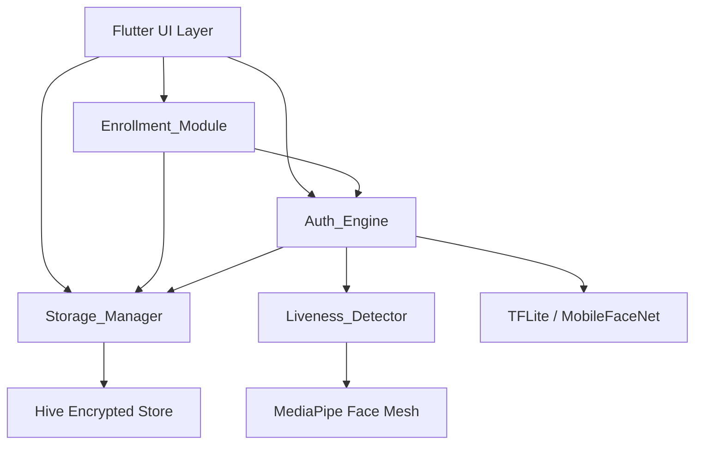
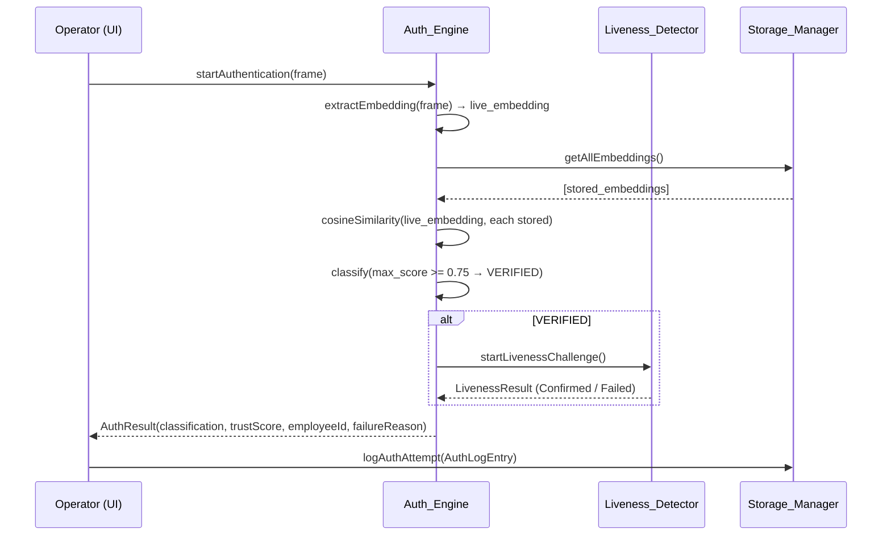
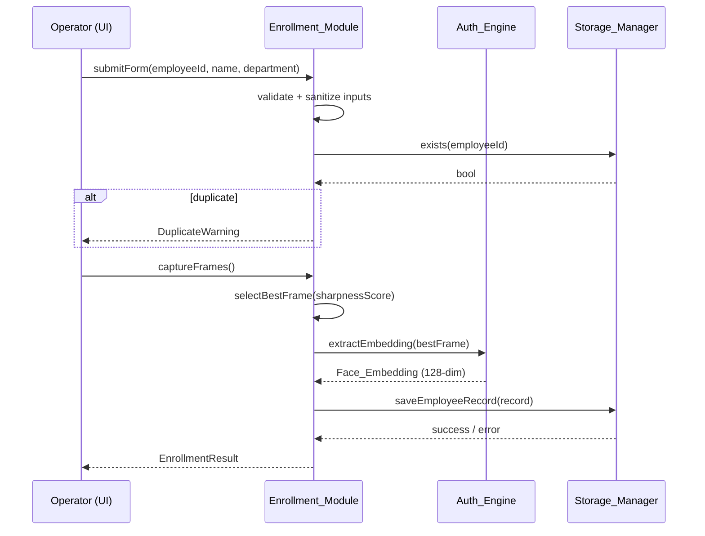

# Design Document

## NHAI Offline Edge-AI Authentication Infrastructure — Phase 1 MVP

---

## Overview

This document describes the technical design for the NHAI Offline Workforce Authentication System — a fully offline, on-device biometric authentication application for Android. The system enables field supervisors (operators) to enroll and authenticate NHAI field workers using face recognition and blink-based liveness detection, with zero cloud dependency.

The design is structured around four bounded modules — Auth_Engine, Enrollment_Module, Liveness_Detector, and Storage_Manager — each implemented as a clearly separated Dart package or library. This modularity supports future extraction as a reusable SDK and integration with Datalake 3.0.

**Core technology choices:**
- Flutter (UI and application shell)
- MobileFaceNet via TensorFlow Lite (face embedding extraction)
- MediaPipe Face Mesh (landmark detection for liveness)
- Hive with AES-256 encryption (local encrypted storage)
- Cosine similarity (face verification metric)

---

## Architecture

The system follows a layered, modular architecture. The Flutter UI layer communicates exclusively through module interfaces; no UI widget has direct access to storage or ML inference.



### Module Boundaries

Each module exposes a Dart abstract class (interface). Concrete implementations are injected at the application shell level, keeping modules decoupled.

```
lib/
  core/
    auth_engine/
      auth_engine_interface.dart
      auth_engine_impl.dart
    enrollment_module/
      enrollment_module_interface.dart
      enrollment_module_impl.dart
    liveness_detector/
      liveness_detector_interface.dart
      liveness_detector_impl.dart
    storage_manager/
      storage_manager_interface.dart
      storage_manager_impl.dart
  models/
    employee_record.dart
    face_embedding.dart
    auth_result.dart
    auth_log_entry.dart
  ui/
    screens/
      splash_screen.dart
      home_screen.dart
      enrollment_form_screen.dart
      face_capture_screen.dart
      authentication_screen.dart
      verification_result_screen.dart
      local_logs_screen.dart
    widgets/
      face_alignment_overlay.dart
      status_badge.dart
      result_card.dart
  app.dart
  main.dart
```

### Data Flow — Authentication



### Data Flow — Enrollment



---

## Components and Interfaces

### Auth_Engine Interface

```dart
abstract class AuthEngineInterface {
  /// Extracts a 128-dimensional embedding from [frame].
  Future<Face_Embedding> extractEmbedding(CameraFrame frame);

  /// Compares [liveEmbedding] against all stored embeddings.
  /// Returns a structured AuthResult within 2 seconds.
  Future<AuthResult> authenticate(CameraFrame frame);
}
```

### Enrollment_Module Interface

```dart
abstract class EnrollmentModuleInterface {
  /// Validates and sanitizes form inputs.
  ValidationResult validateForm(String employeeId, String name, String department);

  /// Selects the highest-quality frame from [frames] by sharpness score.
  CameraFrame selectBestFrame(List<CameraFrame> frames);

  /// Orchestrates the full enrollment flow.
  Future<EnrollmentResult> enroll(EmployeeFormData formData, List<CameraFrame> frames);
}
```

### Liveness_Detector Interface

```dart
abstract class LivenessDetectorInterface {
  /// Processes a stream of camera frames and resolves when a valid blink
  /// is detected or the 5-second timeout expires.
  Future<LivenessResult> detectLiveness(Stream<CameraFrame> frameStream);
}
```

### Storage_Manager Interface

```dart
abstract class StorageManagerInterface {
  Future<void> saveEmployeeRecord(EmployeeRecord record);
  Future<EmployeeRecord?> getEmployeeRecord(String employeeId);
  Future<List<EmployeeRecord>> getAllEmployeeRecords();
  Future<bool> employeeExists(String employeeId);
  Future<void> deleteEmployeeRecord(String employeeId);

  Future<void> logAuthAttempt(AuthLogEntry entry);
  Future<List<AuthLogEntry>> getAuthLogs({int limit = 100});

  Future<void> logStorageError(String message);
}
```

---

## Data Models

### EmployeeRecord

```dart
class EmployeeRecord {
  final String employeeId;       // alphanumeric, max 20 chars
  final String name;             // max 60 chars
  final String department;       // max 60 chars
  final FaceEmbedding embedding; // 128-dimensional float vector
  final DateTime enrolledAt;     // enrollment timestamp (UTC)
}
```

### FaceEmbedding

```dart
class FaceEmbedding {
  final List<double> vector; // 128 float values from MobileFaceNet
}
```

### AuthResult

```dart
enum AuthClassification { verified, failed }

class AuthResult {
  final AuthClassification classification;
  final double trustScore;          // 0.0–1.0 cosine similarity
  final String? matchedEmployeeId;  // null if FAILED
  final String? failureReason;      // null if VERIFIED
}
```

### AuthLogEntry

```dart
class AuthLogEntry {
  final String id;                  // UUID
  final DateTime timestamp;         // ISO 8601 UTC
  final AuthClassification result;
  final double trustScore;
  final String? employeeId;         // null if no match
  final String? failureReason;      // null if VERIFIED
}
```

### Serialization Schema

All records are serialized to JSON before AES-256 encryption. The canonical JSON schema for `EmployeeRecord`:

```json
{
  "employeeId": "string",
  "name": "string",
  "department": "string",
  "embedding": [0.0, ...],
  "enrolledAt": "2024-01-01T00:00:00.000Z"
}
```

`AuthLogEntry` JSON schema:

```json
{
  "id": "uuid-string",
  "timestamp": "2024-01-01T00:00:00.000Z",
  "result": "verified|failed",
  "trustScore": 0.0,
  "employeeId": "string|null",
  "failureReason": "string|null"
}
```

### Storage Layout (Hive)

Two Hive boxes, each encrypted with AES-256:

| Box Name            | Key              | Value                        |
|---------------------|------------------|------------------------------|
| `employee_records`  | `employeeId`     | JSON-encoded EmployeeRecord  |
| `auth_logs`         | auto-increment   | JSON-encoded AuthLogEntry    |

The encryption key is generated once on first launch using `flutter_secure_storage` and stored in the Android Keystore. It is never written to Hive itself.

### Cosine Similarity

```
similarity(a, b) = (a · b) / (||a|| × ||b||)
```

Threshold: **0.75** → VERIFIED. Values below 0.75 → FAILED.

### EAR (Eye Aspect Ratio) for Blink Detection

```
EAR = (||p2 - p6|| + ||p3 - p5||) / (2 × ||p1 - p4||)
```

Where p1–p6 are MediaPipe Face Mesh eye landmark coordinates. A blink is confirmed when EAR drops below **0.25** and recovers above **0.25** within **400 ms**.

---


## Correctness Properties

*A property is a characteristic or behavior that should hold true across all valid executions of a system — essentially, a formal statement about what the system should do. Properties serve as the bridge between human-readable specifications and machine-verifiable correctness guarantees.*

---

### Property 1: Classification threshold is a total function

*For any* pair of face embeddings (live and stored), the cosine similarity score determines the classification deterministically: a score ≥ 0.75 always produces VERIFIED, and a score < 0.75 always produces FAILED — with no other possible outcomes.

**Validates: Requirements 6.4, 6.5**

---

### Property 2: Embedding dimensionality invariant

*For any* valid camera frame passed to `extractEmbedding`, the returned `FaceEmbedding` vector always contains exactly 128 float values.

**Validates: Requirements 4.6, 6.2**

---

### Property 3: Best frame selection is a maximum

*For any* non-empty list of camera frames with associated sharpness scores, `selectBestFrame` returns the frame with the strictly highest sharpness score.

**Validates: Requirements 4.4**

---

### Property 4: Input sanitization removes surrounding whitespace

*For any* enrollment form input string, the value stored in the `EmployeeRecord` equals the original string with all leading and trailing whitespace removed.

**Validates: Requirements 3.4**

---

### Property 5: Empty field validation rejects incomplete submissions

*For any* enrollment form submission where at least one of the three mandatory fields (Employee ID, Name, Department) is empty or composed entirely of whitespace, `validateForm` returns a failure result and no record is written to storage.

**Validates: Requirements 3.2**

---

### Property 6: Employee_Record round-trip serialization

*For any* valid `EmployeeRecord` object, the pipeline of serialize → encrypt → write → read → decrypt → deserialize produces an object that is field-for-field equal to the original.

**Validates: Requirements 10.1, 10.2, 10.3, 10.4**

---

### Property 7: Stored data is encrypted at rest

*For any* `EmployeeRecord` or `AuthLogEntry` written to the Hive store, the raw bytes persisted to disk are not equal to the plaintext JSON representation of that record.

**Validates: Requirements 5.1, 9.5**

---

### Property 8: Employee_Record atomic write — all fields present on retrieval

*For any* successfully saved `EmployeeRecord`, retrieving it by `employeeId` returns an object containing all five fields: `employeeId`, `name`, `department`, `embedding`, and `enrolledAt`.

**Validates: Requirements 5.2**

---

### Property 9: Liveness challenge is triggered if and only if face verification is VERIFIED

*For any* authentication flow, the `Liveness_Detector` is invoked if and only if the `Auth_Engine` face comparison produces a VERIFIED classification. A FAILED face comparison must never trigger liveness detection.

**Validates: Requirements 7.1**

---

### Property 10: Blink detection correctly classifies EAR sequences

*For any* EAR time series where the value drops below 0.25 and recovers above 0.25 within 400 ms, `detectLiveness` returns `LivenessResult.confirmed`. For any EAR time series that does not satisfy this condition within 5 seconds, it returns `LivenessResult.failed`.

**Validates: Requirements 7.3, 7.4**

---

### Property 11: Result screen displays all required fields for any AuthResult

*For any* `AuthResult` with classification VERIFIED, the rendered result screen contains the employee name, employee ID, department, trust score as a percentage, "Liveness: Confirmed", and "Mode: Offline Active". *For any* `AuthResult` with classification FAILED, the screen contains "Authentication Failed", the failure reason, and "Mode: Offline Active".

**Validates: Requirements 8.1, 8.2, 8.3**

---

### Property 12: Authentication attempt is always logged

*For any* completed authentication flow (VERIFIED or FAILED), a corresponding `AuthLogEntry` is written to the Encrypted_Store containing timestamp, result, trust score, employee ID (if matched), and failure reason (if applicable).

**Validates: Requirements 8.6, 9.1**

---

### Property 13: Log entries are retrieved in reverse chronological order

*For any* collection of `AuthLogEntry` records in the store, `getAuthLogs` returns them ordered from most recent to oldest by timestamp.

**Validates: Requirements 9.2**

---

### Property 14: Log rotation maintains the 1000-entry cap

*For any* log store that contains exactly 1000 entries, writing one additional entry causes the oldest entry (by timestamp) to be deleted, keeping the total at 1000.

**Validates: Requirements 9.4**

---

### Property 15: No network calls during any core operation

*For any* invocation of enroll, authenticate, detectLiveness, or result display, zero outbound network requests are made.

**Validates: Requirements 6.7, 7.6, 11.2**

---

### Property 16: Auth_Engine always returns a complete structured result

*For any* call to `Auth_Engine.authenticate`, the returned `AuthResult` object always contains all four fields: `classification`, `trustScore`, `matchedEmployeeId` (nullable), and `failureReason` (nullable).

**Validates: Requirements 12.3**

---

## Error Handling

### Embedding Extraction Failure
- `Auth_Engine.extractEmbedding` returns a typed `EmbeddingError` with a descriptive code (e.g., `NO_FACE_DETECTED`, `LOW_QUALITY_FRAME`, `MODEL_INFERENCE_FAILED`).
- The `Enrollment_Module` and `Auth_Engine` translate error codes to human-readable messages displayed in the UI.
- The operator is always offered a retry option.

### Storage Write Failure
- `Storage_Manager.saveEmployeeRecord` uses a transactional write pattern: the record is only committed if all fields are written successfully.
- On failure, any partial data is rolled back. The `Enrollment_Module` displays an error and does not show a success screen.
- Storage errors are logged to a separate in-memory error buffer (not the encrypted store, to avoid recursive failure).

### Corrupted Record on Read
- During `getAllEmployeeRecords`, each record is deserialized individually inside a try-catch.
- A corrupted record is skipped; a `StorageErrorEntry` is written to the log.
- The remaining records are returned normally, ensuring one bad record does not block authentication.

### No Face Detected (Enrollment / Authentication)
- After 10 seconds without face detection, the camera session displays a timeout message.
- The operator can dismiss and retry without restarting the full flow.

### Liveness Timeout
- After 5 seconds without a valid blink, `Liveness_Detector` resolves with `LivenessResult.failed`.
- `Auth_Engine` propagates this as `AuthResult(classification: failed, failureReason: "Liveness check failed")`.

### Encryption Key Unavailability
- If the AES-256 key cannot be retrieved from the Android Keystore on launch, the app displays a critical error screen and blocks all operations. This prevents operating on unencrypted data.

---

## Testing Strategy

### Dual Testing Approach

Both unit tests and property-based tests are required. They are complementary:
- Unit tests verify specific examples, integration points, and error conditions.
- Property-based tests verify universal correctness across the full input space.

### Property-Based Testing

**Library**: [`fast_check`](https://pub.dev/packages/fast_check) (Dart) or [`dart_test` with custom generators]. The recommended library is `fast_check` for its Dart-native API and shrinking support.

**Configuration**: Each property test runs a minimum of **100 iterations**.

**Tag format** for each test:
```
// Feature: nhai-offline-auth, Property <N>: <property_text>
```

Each correctness property defined above maps to exactly one property-based test:

| Property | Test Description | Generator Inputs |
|----------|-----------------|-----------------|
| P1 | Classification threshold | Random float pairs (similarity scores) |
| P2 | Embedding dimensionality | Random valid CameraFrame mocks |
| P3 | Best frame selection | Random lists of (frame, sharpnessScore) pairs |
| P4 | Input sanitization | Random strings with arbitrary leading/trailing whitespace |
| P5 | Empty field validation | Random form inputs with at least one empty/whitespace field |
| P6 | Round-trip serialization | Random valid EmployeeRecord instances |
| P7 | Encrypted at rest | Random EmployeeRecord and AuthLogEntry instances |
| P8 | Atomic write completeness | Random valid EmployeeRecord instances |
| P9 | Liveness trigger condition | Random AuthResult values (VERIFIED and FAILED) |
| P10 | Blink EAR classification | Random EAR time series (valid blinks and non-blinks) |
| P11 | Result screen fields | Random AuthResult instances (both classifications) |
| P12 | Auth attempt always logged | Random authentication flows |
| P13 | Log reverse chronological order | Random collections of AuthLogEntry with random timestamps |
| P14 | Log rotation cap | Log stores at exactly 1000 entries + one new entry |
| P15 | No network calls | Random enrollment and authentication flows |
| P16 | Auth_Engine complete result | Random authentication inputs |

### Unit Tests

Unit tests focus on:
- Specific examples: known face pairs with known similarity scores, known EAR sequences
- Integration points: `Enrollment_Module` → `Auth_Engine` → `Storage_Manager` pipeline
- Error conditions: corrupted records, write failures, embedding extraction failures, liveness timeout
- UI widget tests: splash screen content, home screen buttons, result screen states, log screen ordering
- Edge cases: duplicate Employee ID, empty form fields, no face detected timeout, 1000-entry log rotation boundary

### Test File Structure

```
test/
  unit/
    auth_engine_test.dart
    enrollment_module_test.dart
    liveness_detector_test.dart
    storage_manager_test.dart
    models/
      employee_record_serialization_test.dart
      auth_log_entry_serialization_test.dart
  property/
    classification_threshold_test.dart      # P1
    embedding_dimensionality_test.dart      # P2
    best_frame_selection_test.dart          # P3
    input_sanitization_test.dart            # P4
    empty_field_validation_test.dart        # P5
    round_trip_serialization_test.dart      # P6
    encrypted_at_rest_test.dart             # P7
    atomic_write_test.dart                  # P8
    liveness_trigger_test.dart              # P9
    blink_ear_classification_test.dart      # P10
    result_screen_fields_test.dart          # P11
    auth_attempt_logging_test.dart          # P12
    log_ordering_test.dart                  # P13
    log_rotation_test.dart                  # P14
    no_network_calls_test.dart              # P15
    auth_engine_result_completeness_test.dart # P16
  widget/
    splash_screen_test.dart
    home_screen_test.dart
    enrollment_form_screen_test.dart
    verification_result_screen_test.dart
    local_logs_screen_test.dart
```
