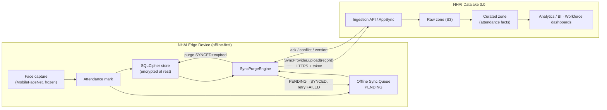

# Datalake 3.0 Integration Flow

The device is **offline-first**: every attendance event is written to the local
SQLCipher store and queued. A `SyncProvider` (the only thing that needs to be
implemented to reach **Datalake 3.0**) drains the queue when connectivity is
available. The AI pipeline is unaffected.

## End-to-end flow



## Where Datalake 3.0 plugs in

`SyncProvider` is already defined as an interface (`lib/attendance/sync/sync_interfaces.dart`):

```dart
abstract class SyncProvider {
  Future<SyncUploadResult> upload(PendingSyncRecord record);
  Future<void> purgeSynced(List<String> entityIds);
}
```

A `DatalakeSyncProvider implements SyncProvider` is the **only** new component
needed to go live — it maps `PendingSyncRecord.payload` (the attendance JSON) to
the Datalake 3.0 ingestion contract and returns success/conflict/version. The
`SyncPurgeEngine`, queue, retry policy, conflict resolver, and encryption are
already built and tested.

## Sync semantics

| Concern | Behaviour |
|---------|-----------|
| Transport | injected `SyncProvider` (HTTPS to Datalake ingestion) |
| Offline | no provider ⇒ records stay `PENDING`; nothing lost |
| Retry | exponential backoff, capped (`RetryPolicy`); `FAILED` re-attempted |
| Conflict | `LastWriteWinsResolver` (server reconciles); pluggable |
| Idempotency | each record carries a stable `syncId` / `attendanceId` |
| Retention | `SyncPurgeEngine.purge` deletes `SYNCED` + expired locally |
| Security | SQLCipher at rest; IDs/scores only on the wire (no biometrics) |

## Payload shape uploaded to Datalake 3.0

```jsonc
{
  "syncId": "SYN-…", "entityType": "attendance", "entityId": "ATT-…",
  "payload": {
    "attendanceId": "ATT-…", "employeeId": "EMP-1001",
    "date": "2026-06-01", "checkInTime": "…", "checkOutTime": "…",
    "verificationMethod": "faceWithBlink", "trustScore": 0.93,
    "deviceId": "NHAI-DEVICE", "offlineMode": true, "isLate": false
  }
}
```

> Biometric embeddings are **never** uploaded — only the attendance fact and its
> trust score. This keeps PII on-device and the Datalake clean for analytics.
