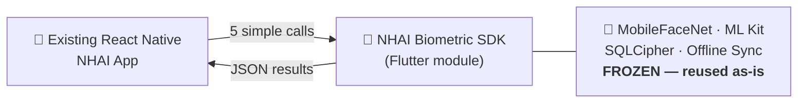
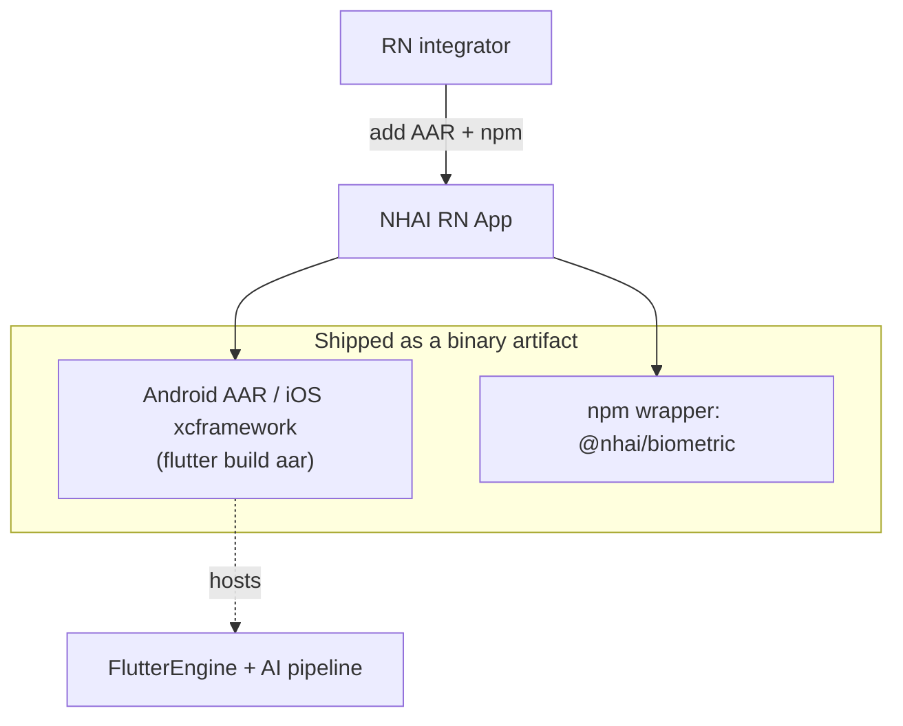
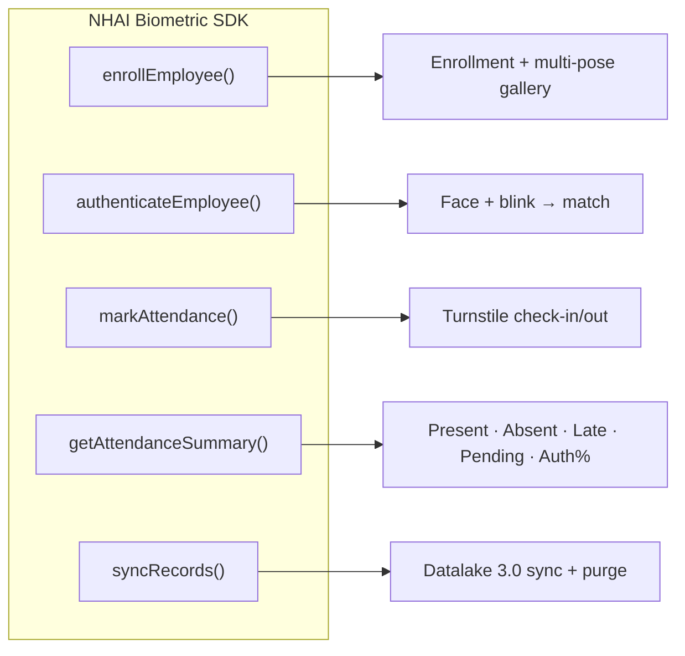
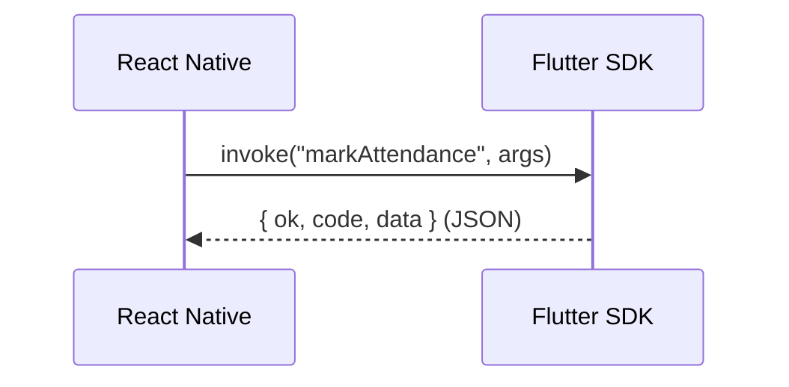
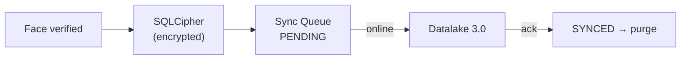
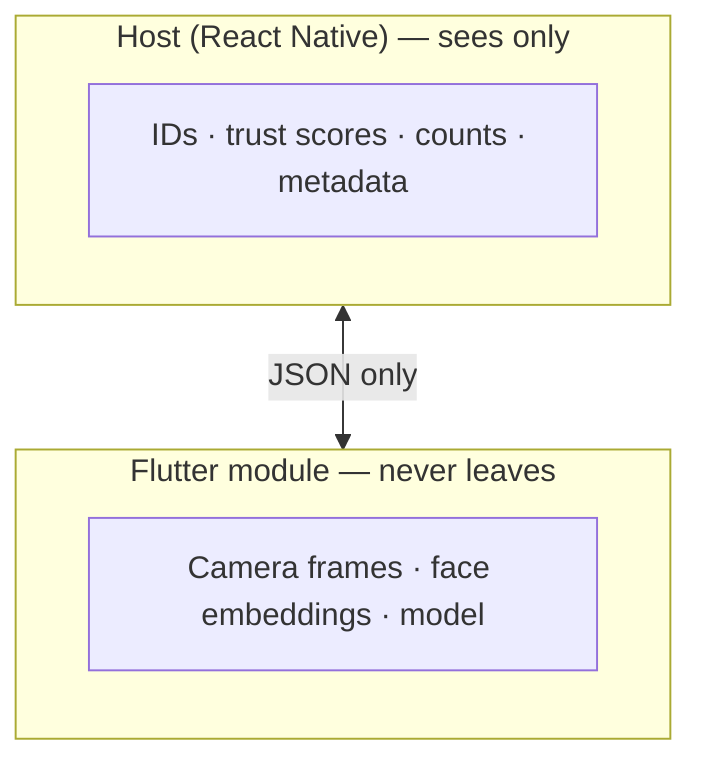

# PPT-Ready Architecture Diagrams

Copy any block into a Mermaid-enabled slide tool (e.g. Marp, Mermaid Live →
PNG/SVG, or the VS Code Mermaid export) to drop straight into the deck.

## Slide 1 — The pitch (one line)

## Slide 2 — Packaging (no AI rewrite)

## Slide 3 — Five API methods

## Slide 4 — Request/response across the channel

## Slide 5 — Offline-first → Datalake 3.0

## Slide 6 — Trust boundary

> Rendering tip: `mmdc -i DIAGRAMS_PPT.md -o slides.png` (Mermaid CLI) or paste
> into https://mermaid.live to export SVG/PNG for the deck.
