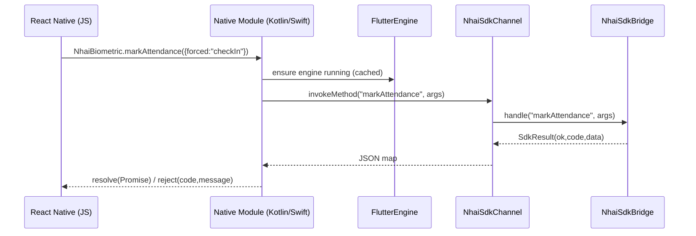

# Platform Channel Design

## Channel

| Property | Value |
|----------|-------|
| Name | `ai.nhai.biometric/sdk` |
| Type | `MethodChannel` (async request/response) |
| Codec | `StandardMethodCodec` (JSON-compatible maps) |
| Direction | Host → Flutter (invoke); Flutter → Host (return `SdkResult` map) |

The Flutter side registers exactly one handler (`NhaiSdkChannel.register`),
which forwards `call.method` + `call.arguments` to `NhaiSdkBridge.handle` and
returns `SdkResult.toJson()`.



## Engine lifecycle (add-to-app)

- The native module keeps a **cached `FlutterEngine`** (Android
  `FlutterEngineCache`, iOS `FlutterEngineGroup`) so the channel and the model
  stay warm between calls — the TFLite interpreter loads once.
- Camera-driven methods (`enrollEmployee`, `markAttendance`,
  `authenticateEmployee`) present the Flutter capture UI via a
  `FlutterFragment`/`FlutterViewController` over the RN screen; data-only
  methods (`getAttendanceSummary`, `syncRecords`) run headless on the channel.

## Error mapping

| Flutter (`SdkResult.code`) | RN result |
|----------------------------|-----------|
| `OK` | `Promise.resolve(data)` |
| any non-OK | `Promise.reject(code, message, data)` |

Codes are stable strings (see [API_CONTRACTS](API_CONTRACTS.md)); the host
branches on `code`, never on message text.

## Threading

- The bridge is fully `async`; the native module invokes on a background
  executor and resolves the JS promise on the platform thread.
- Only one camera-driven flow runs at a time (the capture screen owns the
  camera); concurrent calls are serialized by the native module.

## Android native module (sketch)

```kotlin
class NhaiBiometricModule(ctx: ReactApplicationContext) : ReactContextBaseJavaModule(ctx) {
  private val channel = MethodChannel(
    FlutterEngineCache.getInstance().get("nhai")!!.dartExecutor.binaryMessenger,
    "ai.nhai.biometric/sdk")

  @ReactMethod fun markAttendance(args: ReadableMap, promise: Promise) {
    channel.invokeMethod("markAttendance", args.toHashMap(), object : MethodChannel.Result {
      override fun success(res: Any?) {
        val m = res as Map<*, *>
        if (m["ok"] == true) promise.resolve(toWritableMap(m["data"]))
        else promise.reject(m["code"] as String, m["message"] as String?)
      }
      override fun error(c: String, msg: String?, d: Any?) = promise.reject(c, msg)
      override fun notImplemented() = promise.reject("UNKNOWN_METHOD", "markAttendance")
    })
  }
}
```
