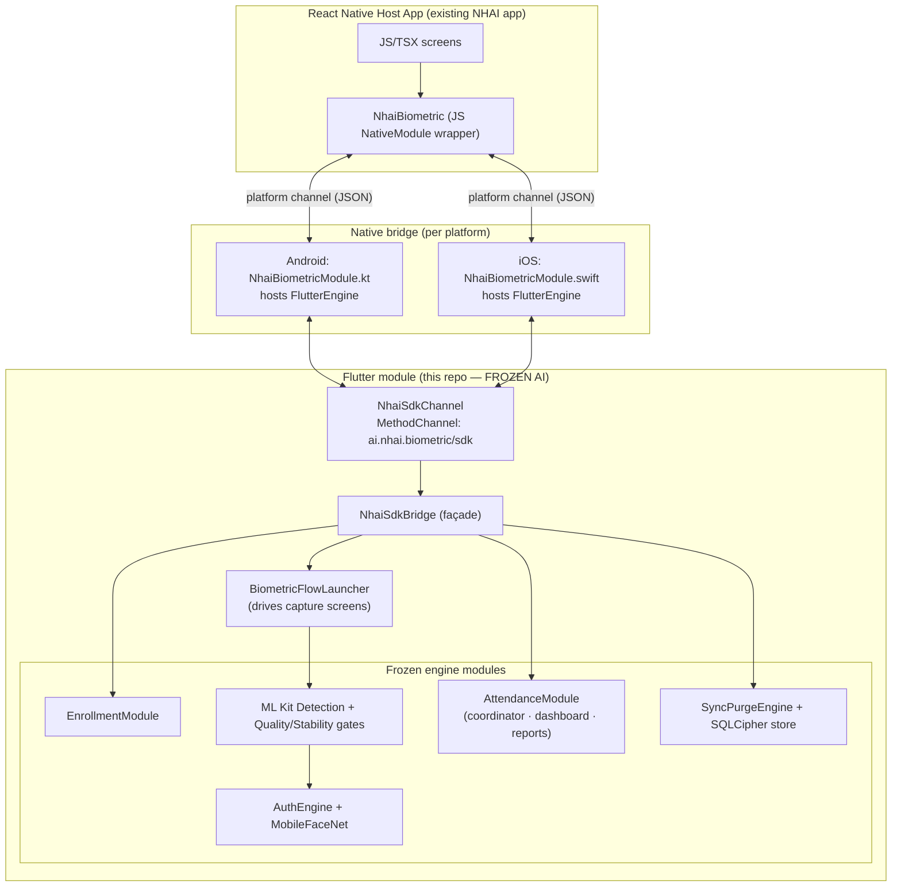
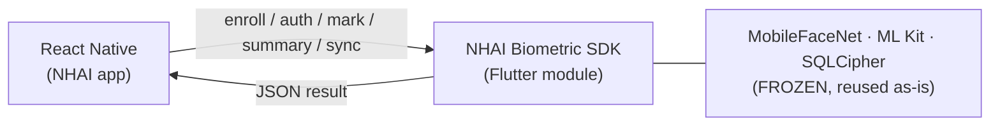

# NHAI Biometric SDK — Architecture

> **Thesis for judges:** the existing Flutter biometric engine (MobileFaceNet +
> ML Kit detection + matcher + offline attendance) is packaged **as-is** behind
> a thin SDK boundary and consumed by an existing **React Native** app — **no
> rewrite of the AI pipeline**.

## 1. Layered architecture

## 2. Why this works without rewriting the AI

- The **AI pipeline never changes**. The SDK is a *consumer*: `NhaiSdkBridge`
  calls the already-shipped `EnrollmentModule`, `AuthEngine`, and
  `AttendanceModule` exactly as the Flutter UI does today.
- **Flutter add-to-app** lets the React Native app embed the compiled Flutter
  module. The native module hosts a `FlutterEngine` and talks to it over a
  `MethodChannel`.
- The **camera + TFLite inference stay inside Flutter**, where they already
  work. The host only sends commands (enroll/auth/mark/summary/sync) and
  receives structured results.

## 3. Component responsibilities

| Component | File | Responsibility |
|-----------|------|----------------|
| `SdkResult` / contracts | `lib/sdk/nhai_sdk_contracts.dart` | wire format, codes, request parsers |
| `NhaiSdkBridge` | `lib/sdk/nhai_sdk_bridge.dart` | method dispatch → frozen modules |
| `BiometricFlowLauncher` | `lib/sdk/nhai_sdk_bridge.dart` | seam to the capture UI (injectable) |
| `NhaiSdkChannel` | `lib/sdk/nhai_sdk_channel.dart` | MethodChannel registration |
| Frozen engine | `lib/core/**`, `lib/attendance/**` | detection, recognition, attendance, sync |

## 4. Data-boundary guarantees

- Face **embeddings and frames never cross** the channel — only IDs, trust
  scores, counts, and metadata (JSON).
- Attendance can only be written through a **live, verified** capture flow; the
  host cannot forge a verified result.
- On-device storage is **SQLCipher-encrypted**; the sync queue is offline-first.

## 5. Packaging / distribution

1. Build the Flutter module as an **AAR** (Android) / **xcframework** (iOS) via
   `flutter build aar` / add-to-app embedding.
2. Publish the JS wrapper (`NhaiBiometric`) as an internal npm package.
3. The React Native app adds the AAR/framework + npm wrapper — done. The AI
   pipeline ships as a binary artifact; integrators never touch model code.

## 6. PPT-ready one-liner diagram

See also: [API_CONTRACTS](API_CONTRACTS.md) · [PLATFORM_CHANNEL_DESIGN](PLATFORM_CHANNEL_DESIGN.md)
· [SEQUENCE_DIAGRAMS](SEQUENCE_DIAGRAMS.md) · [DATALAKE_3.0_INTEGRATION](DATALAKE_3.0_INTEGRATION.md)
· [DIAGRAMS_PPT](DIAGRAMS_PPT.md)
