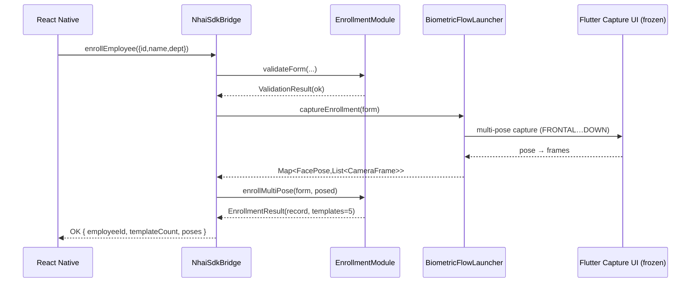
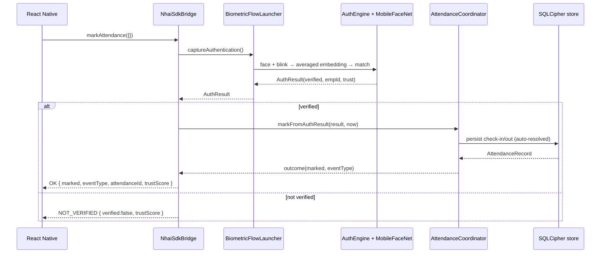
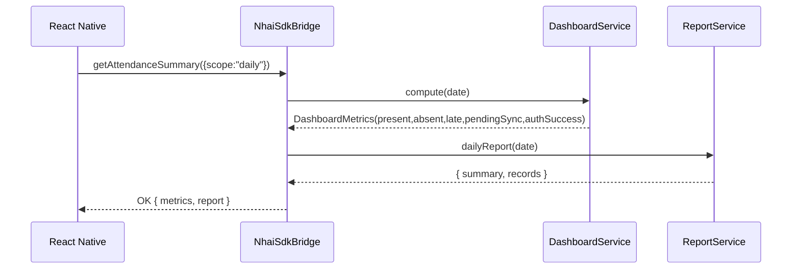
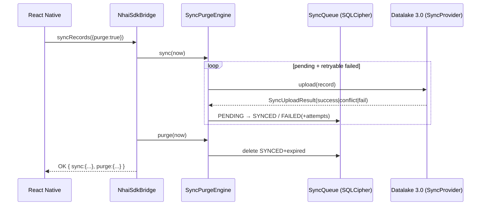

# Sequence Diagrams

## 1. Enroll employee

```mermaid
sequenceDiagram
  participant RN as React Native
  participant BR as NhaiSdkBridge
  participant ENR as EnrollmentModule
  participant LAU as BiometricFlowLauncher
  participant CAM as Flutter Capture UI (frozen)

  RN->>BR: enrollEmployee({id,name,dept})
  BR->>ENR: validateForm(...)
  ENR-->>BR: ValidationResult(ok)
  BR->>LAU: captureEnrollment(form)
  LAU->>CAM: multi-pose capture (FRONTAL…DOWN)
  CAM-->>LAU: pose → frames
  LAU-->>BR: Map<FacePose,List<CameraFrame>>
  BR->>ENR: enrollMultiPose(form, posed)
  ENR-->>BR: EnrollmentResult(record, templates=5)
  BR-->>RN: OK { employeeId, templateCount, poses }
```

## 2. Authenticate + mark attendance (turnstile)

```mermaid
sequenceDiagram
  participant RN as React Native
  participant BR as NhaiSdkBridge
  participant LAU as BiometricFlowLauncher
  participant AUTH as AuthEngine + MobileFaceNet
  participant CO as AttendanceCoordinator
  participant DB as SQLCipher store

  RN->>BR: markAttendance({})
  BR->>LAU: captureAuthentication()
  LAU->>AUTH: face + blink → averaged embedding → match
  AUTH-->>LAU: AuthResult(verified, empId, trust)
  LAU-->>BR: AuthResult
  alt verified
    BR->>CO: markFromAuthResult(result, now)
    CO->>DB: persist check-in/out (auto-resolved)
    DB-->>CO: AttendanceRecord
    CO-->>BR: outcome(marked, eventType)
    BR-->>RN: OK { marked, eventType, attendanceId, trustScore }
  else not verified
    BR-->>RN: NOT_VERIFIED { verified:false, trustScore }
  end
```

## 3. Get attendance summary (headless, no camera)

```mermaid
sequenceDiagram
  participant RN as React Native
  participant BR as NhaiSdkBridge
  participant DASH as DashboardService
  participant REP as ReportService

  RN->>BR: getAttendanceSummary({scope:"daily"})
  BR->>DASH: compute(date)
  DASH-->>BR: DashboardMetrics(present,absent,late,pendingSync,authSuccess)
  BR->>REP: dailyReport(date)
  REP-->>BR: { summary, records }
  BR-->>RN: OK { metrics, report }
```

## 4. Sync + purge

```mermaid
sequenceDiagram
  participant RN as React Native
  participant BR as NhaiSdkBridge
  participant SP as SyncPurgeEngine
  participant Q as SyncQueue (SQLCipher)
  participant DL as Datalake 3.0 (SyncProvider)

  RN->>BR: syncRecords({purge:true})
  BR->>SP: sync(now)
  loop pending + retryable failed
    SP->>DL: upload(record)
    DL-->>SP: SyncUploadResult(success|conflict|fail)
    SP->>Q: PENDING → SYNCED / FAILED(+attempts)
  end
  BR->>SP: purge(now)
  SP->>Q: delete SYNCED+expired
  BR-->>RN: OK { sync:{...}, purge:{...} }
```
